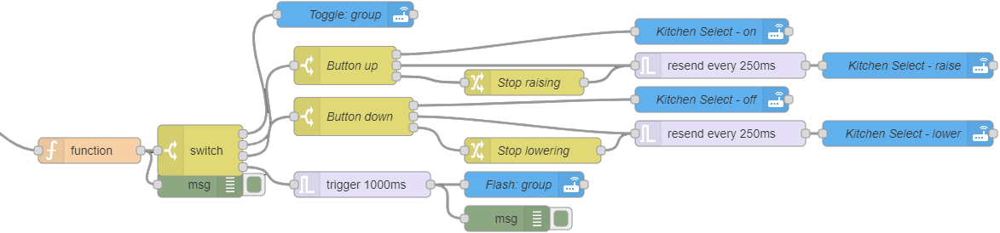
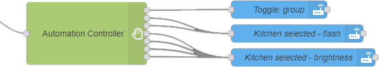

# node-red-contrib-automationController
The automation controller is used to help out with home automation in mind, but has other purposes as well.
The main idea is to keep multiple inputs for the same external component to be handled within this node and output a generic result.

For the easiest example: A button! Click, Double click, Hold/Release are states that the same component reports. This node enables all these states to be handled inside it and outputs a customized result.
For more complex usage, the JavaScript field type can be used on multiple fields to enable more comprehensive tasks.

## Argument
I was making a test with home automation where an IKEA 5 button implementation went crazy as shown here:

This node is a result of this code and resulted in this:

  
**Fig. 1:** Node appearance

## Installation

### In Node-RED (preferred)
* Via Manage Palette -> Search for "node-red-contrib-automation-controller"

### In a shell
* go to the Node-RED installation folder, e.g.: `~/.node-red`
* run `npm install node-red-contrib-automation-controller`

## Usage

**Fig. 2:** Node explaination

The automation controller node is a multi-functional event/State handling node that takes an input and tries to match it against a number of different created rules.
Each rule have their own setup on how it should be behave.
The purpose of the node is to compress the complexity of the node schematics when having multiple behaviors for a single component, for example a button controlling a light in home automation or a server status that should trigger different gui components to be updated with states.

  
**Fig. 3:** Node appearance

The node has up to 10 different rules that can be customized to fit the purpose of the specified function.
The node has by default multiple outputs _(one for each rule, but can be reconfigured to have only a single output)_.

### Node Configuration
The node configuration sets up how the sensor should react.

  
**Fig. 4:** Node properties

#### Name (optional)
_(Optional)_ The name of this node. _(Will change the content of the node to the name)_

#### Input
The field to read and validate against the rule's **Match mode** _(for events)_ or **Activate on** and **Deactivate on** _(for states)_

#### Behavior
Tells how the node should react when an execution occurs.
 * **Allow only single action**, Will only allow an execution only when the node is idle.
 * **Allow all actions**, Will freely allow executions of any rule no matter while another rule is active or not.
 * **Cancel ongoing actions**, Will abort all ongoing rule executions when a new rule is executed.

#### Rule tab list
  
Each button/tab represents a rule. By clicking on it, the rule is presented.
To add a new rule, pres the + button _(there's a maximum of 10 rules)_.

#### Item name
_(Optional)_ Sets the name of the currently selected rule.

#### Match mode
Sets the mode of how this rule should function.
 * **Event**, Will execute and then go back to idle state. _(Think of it as a mouse button)_
 * **State**, Will execute and keeps active until deactivated. _(Think of it as a power button or a switch)_

### Event

#### When match
The value to match the **input** field against. When matched, this rule will be executed.

#### Cooldown
The time to wait before this action can be executed again. _(This will also prevent other rules to be executed if **behavior** is preventing multiple rules.)_
_(Zero for disabled)_

#### Reset event timeout
The time to wait before the rule's current value is reset to the initial.
_(Zero for disabled)_

### State

#### Activate on
The value to match the **input** field against to begin execute the rule.
_**JS accepted:** This field is designed to handle JavaScript (see JavaScript secion for more info). It will accept the return value to match against the input or, it can return a true/false statement to tell if matched the field._

#### Deactivate on
The value to match the **input** field against to halt/stop the execution of this rule.
_**JS accepted:** This field is designed to handle JavaScript (see JavaScript secion for more info). It will accept the return value to match against the input or, it can return a true/false statement to tell if matched the field._

#### Time out
The time to wait before this action can be executed again. _(This will also prevent other rules to be executed if **behavior** is preventing multiple rules.)_
_(Zero for disabled)_

#### Trigger action on activate...
If **checked**, the **Activate on** match can occur while already active. Otherwise only **Deactivate on** match will be checked.

#### Message on repeat
The message to use for repeat messages:
 * **JSON**, a customly specified JSON message to use.
 * **Original message**, The message that triggered the first activation.
 * **Latest message**, The last message that has entered the node.

#### Repeat
The time to wait before this action can be executed again. _(This will also prevent other rules to be executed if **behavior** is preventing multiple rules.)_
_(Zero for disabled)_

#### Send on inactive
The message to send when the state becomes inactive either through **Deactivate on** or the **Time out**.
_**JS accepted:** This field is designed to handle JavaScript (see JavaScript secion for more info). It can return free of choice._

#### Reset to initial value...
If **checked**, the output mode's current value will be set to its **Initial value**. _(The result depends on the **Output mode** that is used.)_.

#### Output
The field to be updated with the result of the execution. _(To allow multiple rules to be executed on the same input, this field is unique per rule)_
_**JS accepted:** This field is designed to handle JavaScript (see JavaScript secion for more info). It can return free of choice._
_Note: **input** value is named **output**._

#### Output engine
Tells how the output should react and work:
 * **Single value**, Sends a simple value.
 * **Iterate value**, Loops _(or just raises)_ from low to high integer values.
 * **Bouncing value**, Bouncing from low to high integer values.
 * **Fixed values**, Uses a predefined list

### Engine: Single value
#### Value
The value to send out to the **output** field.
_**JS accepted:** This field is designed to handle JavaScript (see JavaScript secion for more info). It can return free of choice._

### Engine: Iterate value
#### Initial value
The initial value to use for first execution or when being reset _(either by **Reset to initial..** or by message input, **msg.state='reset'**)_.
*This value must resolve into an integer number.*
_**JS accepted:** This field is designed to handle JavaScript (see JavaScript secion for more info). It must return a valid integer, or 0 will be used._

#### Min
The minimum value to use when cycling through the value. _(Must resolve into an integer value less than **max** value)_

#### Max
The maximum value to use. _(Must resolve into an integer value greater than **min** and **initial** value)_
When this value is reached, the loop will either stop executing _(if not to **cycle**)_ or move to the **min** value _(if to **cycle**)_.

#### Steps
The number of jumps to add to the current value for each iteration/execution. _(Must resolve into a positive integer value)_

#### Cycle
If checked, the value will cycle to min value when reached the max. Otherwise, the execution of the rule will be prevented.

#### Ensure edges reached
If checked, the value will ensure that the max value is sent if the value reached beyond the max value _(if steps is greater than 1 it might end up in max+X)_.
And if cycle is checked, the min value will be set _(instead of "curValue - (max-min)")_.

### Engine: Bouncing value
#### Initial value
The initial value to use for first execution or when being reset _(either by **Reset to initial..** or by message input, **msg.state='reset'**)_.
*This value must resolve into an integer number.*
_**JS accepted:** This field is designed to handle JavaScript (see JavaScript secion for more info). It must return a valid integer, or 0 will be used._

#### Min
The minimum value to use. _(Must resolve into an integer value less than **max** value)_
When this value is reached, the iteration will turn to use the **Positive steps**.

#### Max
The maximum value to use. _(Must resolve into an integer value greater than **min**)_
When this value is reached, the iteration will turn to use the **Negative steps**.

#### Positive steps
The number of jumps to add to the current value for each iteration/execution while in the positive mode. _(Must resolve into a positive integer value)_

#### Negative steps
The number of jumps to subtract from the current value for each iteration/execution while in the negative mode. _(Must resolve into a positive integer value and will automatically be converted to a negative value)_

#### Ensure edges reached
If checked, the value will ensure that the max value is sent if the value reached beyond the max value _(if steps is greater than 1 it might end up in **max**+(X-1) or **min**-(X-1) and will be converted to just **min**/**max**.)_.

### Engine: Fixed values
#### Initial index
The initial index to use for first execution or when being reset _(either by **Reset to initial..** or by message input, **msg.state='reset'**)_.
This value must resolve into a positive integer number matching one of the items _(First record starts on zero)_
_**JS accepted:** This field is designed to handle JavaScript (see JavaScript secion for more info). It must return a valid integer, or 0 will be used._

#### Index #
The value to send when current index maches this row.
_**JS accepted:** This field is designed to handle JavaScript (see JavaScript secion for more info). It can return free of choice._

#### - button
Removes the record of the related row clicked.

#### + button
Adds a new record to the fixed values.

#### Cycle
If checked, the index will move to the first record when cycled through. Otherwise it will prevent the execution.

### Engine: Linked rule
#### Link to rule
The rule to execute instead when this rule is executed.

#### Mirror effect
If checked, the engine that is executed will work in reverse. _(This is convenient if to have two inputs that toggles raise/lower.)_
Otherwise, the rule will just be executed in normal mode.

#### Update target rule's last value
If checked, the target _(rule linked to)_ will have it's latest value stored in it for usage with the JavaScript functions.
Otherwise, only the current rule will have it's latest value stored.

### Special inputs
The **msg.state** can be used to reset the state of the current **output engine**.
The **msg.engineValue** can be used to override the current value _(before execution, this means that the value will be altered)_.

### JavaScript
Some fields has been JavaScript enabled. The engine works the same way in all different functions.
It contains the following access features:
 * **input**: Is available for the **When match**, **activate on** and **Deactivate on** fields and contains the input value.
 * **output**: Is available for the **output** field and contains the output data of the rule.
 * **lastValue**: Contains the latest executed value from all the rules.
 * **lastRuleValue**: Contains the latest executed value from the current rule.
 * **lastRuleName**: Contains the name of the latest executed rule.
 * **msg**: The active message object.
 * **console**: The console to debug with.
 * **context**: Contains the _get. set, keys, global, flow_ function.
 * **flow**: Contains the _get. set, keys_ function.
 * **global**: Contains the _get. set, keys_ function.
 * **env**: Contains the _get_ function.
 * **rules**: Contains the _index(index|name), name(index|name), value(index|name,[newValue]), isActive(index|name), length()_ functions.

#### rules object:
 * **index(rule.index | rule.name)**: will get the index of the specified rule.
 * **name(rule.index | rule.name)**: will get the name of the specified rule.
 * **value(rule.index | rule.name)**: will get the latest returned value.
 * **value(rule.index | rule.name, newValue)**: will set the current value _(it's the value before next execution)_
 * **isActive(rule.index | rule.name)**: will tell if the specified rule is currently active or not.
 * **length()**: Will get the number of rules that exists in this node.

## Examples
***
**Remark**: Example flows are present in the examples subdirectory. In Node-RED they can be imported via the import function and then selecting *Examples* in the vertical tab menu.
***

### Example 1: Basic usage
This example shows the basic usage.
The configuration simulates how a button can be clicked, double clicked or hold/release and gives you the result in three different debug nodes.

[**example-1.json**](examples/example-1.json)  
**Fig. 5:** Basic usage example

## Version history
v1.0.0 Completed documentation and translations
v0.1.0 Initial release

## Credits
- [TLacke](https://github.com/TLacke)